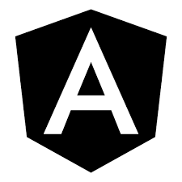
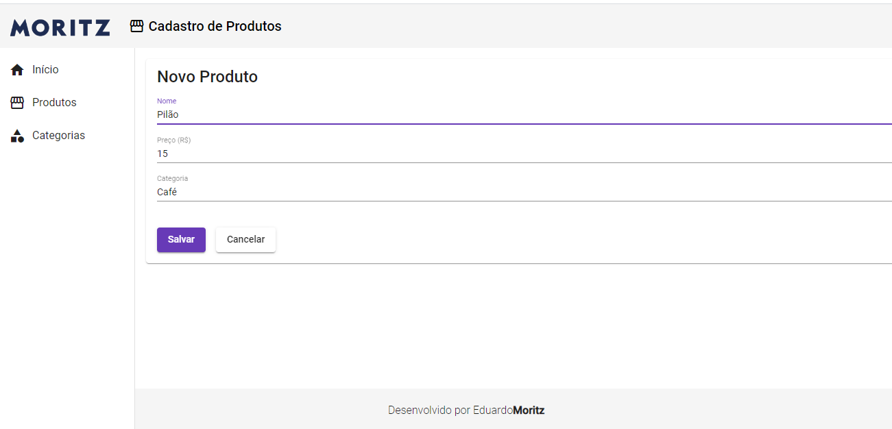
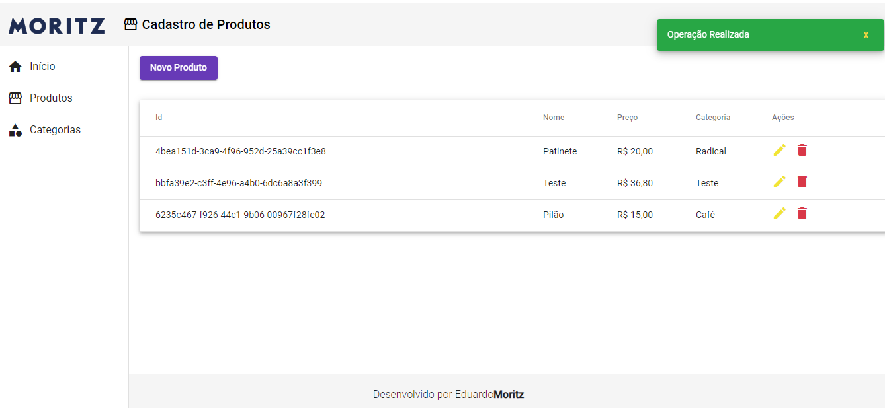
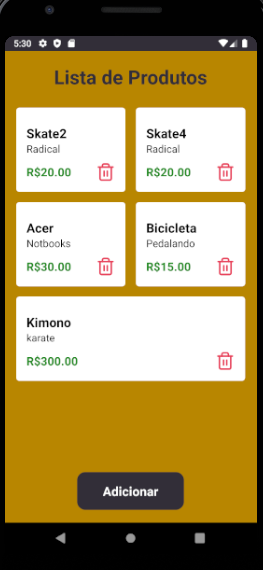

<br />
<p align="center">
  <a>
    
    
    
  </a>
</p>

<h3 align="center">
  Aplicação API Rest CRUD
</h3>

<p align="center">
  <a>
    
  </a>

  <a href="https://github.com/edumoritz/test-mke/commits/master">
    
  </a>

  <a href="https://www.linkedin.com/in/eduardo-moritz-5298a0118/">
    
  </a>
  
  <a>
    
  </a>
</p>

<p align="center">
Essa aplicação é um exemplo de CRUD com API Rest de produtos, com os campos: id, nome, preço e categoria.
<p>


## 📖 Índice

- [Tecnologias](#tecnologias)
- [Funcionalidades](#funcionalidades)
- [Installation](#installation)
- [Feedback](#feedback)

## :rocket: Tecnologias

* Backend: Node e Typescript,
* Frontend: Angular,
* Mobile: React-Native,

## :bookmark: Funcionalidades

* Você pode realizar um push de um produto com ou sem categoria, caso você informe a categoria ela será analisada pelo backend se não existir uma categoria com mesmo nome ela será gravada na "tabela" de categorias. 
* Quando você realizar uma requisição get trazendo todos os produtos será listado os produtos e as categorias.
* Na requisição get por id será retornardo apenas um produto com sua categoria.
* No delete será excluido o produto.

<p align="center">
  
  
</p>

<p align="center">  
  
</p>


## Installation

Primeiro é preciso clonar este repositório com o seguinte comando:
```
  git clone https://github.com/edumoritz/test-mke.git 
```
Logo após clonar é preciso entrar na pasta do projeto:
```
  cd test-mkr
```
* <h3>Backend</h3>
Dentro dessa pasta irá conter 3 pastas que são: backend, frontend e mobile.
Sendo assim é preciso primeiro entrar na pasta backend e executar a instalação para assim executa-lo dessa forma:
```
  cd backend
  // Instalação das dependencias:
  yarn install
  
  // Iniciar a aplicação
  // yarn start
```
* <h3>Frontend</h3>
Com o backend inicializado é possivel realizar testes com as ferramentas do tipo postman/isominia ou executar o frontend.
Para Executar o frontend é preciso voltar para a pasta raiz mas é preciso deixar o backend executando então abra um outro terminal e navegue até a pasta frontend e execute os seguintes comandos:
```
  cd frontend
  // Instalação das dependencias:
  yarn install
  
  // Iniciar a aplicação
  // yarn start
```
* <h3>Mobile</h3>
No Mobile tem algumas formas diferentes para executar, no meu caso eu utilizei o dispositivo fisico, irei listar algumas das formas de se conectar:

* Com SDK executar: adb reverse tcp:3333 tcp:3333
* iOS com Emulador: localhost
* iOS com físico: IP da máquina
* Android com Emulador: localhost (adb resverse)
* Andorid com Emulador: 10.0.2.2 (Android Studio)
* Android com Emulador: 10.0.3.2 (Genymotion)
* Android com físico: IP da máquina (Utilizei essa forma)

O arquivo para ser alterado da api está na pasta <a href="https://github.com/edumoritz/test-mke/blob/master/mobile/src/services/api.js">service/api.js
</a>
```ts
import axios from 'axios';

const api = axios.create({
  baseURL: 'http://{aqui deve colocar o host especifico}:3333/'
});

export default api;
```
Para executar o mobile é preciso navegar até a pasta mobile e executar os comandos:
```
  cd mobile
  // Instalação das dependencias:
  yarn install
  
  // Iniciar a aplicação
  // yarn android
```

## Feedback

Feel free to send me feedback on [LinkedIn](https://www.linkedin.com/in/eduardo-moritz-5298a0118/) or [file an issue](https://github.com/edumoritz/test-mke). Feature requests are always welcome.

